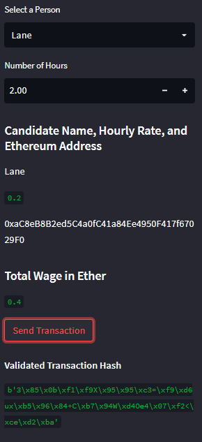
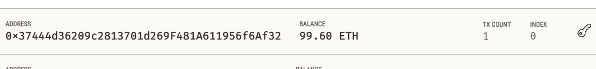
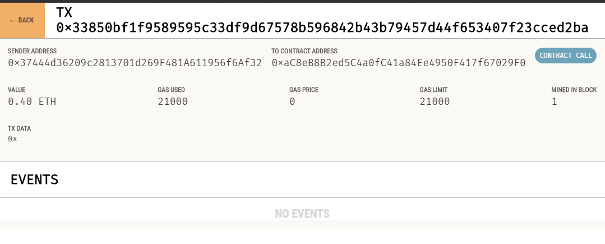

# Fintech Finder
Ethereum blockchain network that enables customers to send cryptocurrency payments 

---

## Summary

Fintech Finder is an application that its customers can use to find fintech professionals from among a list of candidates and pay them. It integrates the Ethereum blockchain network into the application in order to enable customers to instantly pay the fintech professionals with cryptocurrency

The Fintech Finder app contains the following files:

* The first file is called `fintech_finder.py`. It contains the code associated with the web interface of your application. The code included in this file is compatible with the Streamlit library. `Streamlit` is an open-source Python library that makes it easy to create web app.
* The second file is called `crypto_wallet.py`. This file contains the Ethereum transaction functions.
* Fintech finder uses a personal blockchain called [Ganache](https://trufflesuite.com/ganache/) which is used for rapid Ethereum and Corda distributed application development. You can use `Ganache` across the entire development cycle; enabling you to develop, deploy, and test your dApps in a safe and deterministic environment.
---
## Installation and Usage

```sh
git clone https://github.com/diegoalcocer/fintech-finder.git
cd fintech-finder/
```
To run the `Streamlit` application:

```sh
 streamlit run fintech_finder.py
```
Make sure you have [streamlit installed](https://docs.streamlit.io/library/get-started/installation). You can use the following command:
```sh
pip install streamlit
```

### 📚 usage

After running the app, you can select a candidate that you would like to hire from the appropriate drop-down menu. Then, enter the number of hours that you would like to hire them for. 

Click the Send Transaction button to sign and send the transaction with your Ethereum account information. If the transaction is successfully communicated to Ganache, validated, and added to a block, a resulting transaction hash code will be written to the Streamlit application sidebar.



If you navigate to the `Ganache` accounts tab you can locate your account (index 0). The address, balance, and transaction (TX) count.


     
You can also navigate to the Ganache transactions tab and locate the transaction.




## License

[](https://www.gnu.org/licenses/gpl-3.0)
